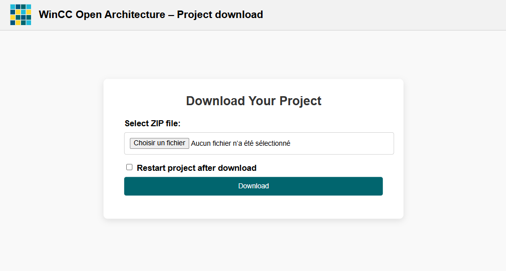

# WinCC OA Project download

A lightweight http handler for project download.




## 🚀 Features

- web page allowing you to download a ZIP file
- automatic decompression of ZIP in the project tree
- option to restart the project after download
- handle multiple servers in case of remote managers by using a datapoint to distribute the ZIP file to each servers.
- special file ``config.env.bat`` started after download, copy files from sub-folder for current hostname in config directory (support FQDN and netbios name). This allow copy of new config or progs files.
- special file ``pmondeploy.txt`` allows to define special commands for WCCILpmon (restart a manager)


## 🛠️ Installation

1. Clone the repository:
   ```bash
   git clone https://github.com/orelmi/winccoa_projectuploader.git
   ```
2. Copy files to project folder

3. Add Control Manager with options ```webclient_http.ctl```

## 📄 Usage

To use the log viewer:

1. Open URL https://localhost/project in any modern browser (Chrome, Firefox, Edge).
2. The page displays the form to download ZIP to the WinCC OA Server
3. Select a file
4. Click on submit

## Technical details

``projectdownload.ctl`` automatically create DPT and DP following argument given in Control Manager options

DPT and DP


Zip file is transmitted to ``projectdownload.ctl`` CTRL as a blob in ``filedata`` DPE allowing to use the project uploader in an architecture composed of a Remote Http Server and a WinCC OA Server.

In case of multiple servers (distribution, remote proxy, dedicated http server), the blob of ZIP file is sent to all DPE of DPT ``PROJECT_DOWNLOAD``. This allows to sent a ZIP file with new scripts, panels, pictures and deploy them everywhere.

A special file ``pmondeploy.txt`` case be sent in ``config`` folder or sub-folder by hostname and could contains a list of Pmon commands.

Stop the 6th manager in the console after deploy. Restarting is automatic if Always mode was configured
```
##SINGLE_MGR:STOP 6
```

Restart all managers after deploy
```
##RESTART_ALL:
```


## 📸 Screenshots

projectdownload.ctl in the Console


## Limitations

1. Unable to update database due to lock. 
2. Web form is not secured. DON'T USE IT IN PRODUCTION !!!!

## Roadmap

1. Add automatic import of DPL files after download.
2. Download directly from Gedi (menu extension).
3. Add options to keep or replace database.
4. Add pmon authentication to secure project download.
5. Add console view in html page.
6. Support of distributed systems.
7. Improve UI/UX.
8. Become native feature of WinCC OA installation !

## Author

Created by Aurélien Michon aka orelmi, 2025