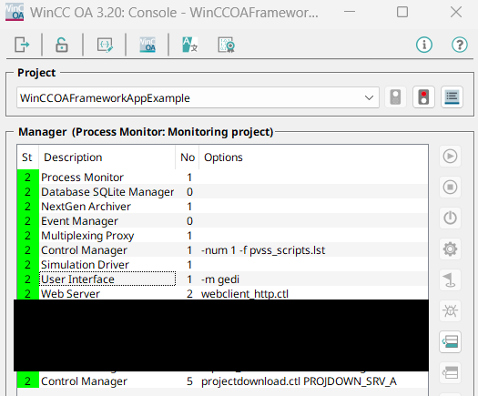

# Project uploader Http Handler
A lightweight http handler for project uploading

## 🚀 Features

- web page allowing you to upload a ZIP file
- automatic decompression of ZIP in the project tree
- special file ``projupcmd`` allows to define the restart commands for WCCILpmon

## 🛠️ Installation

1. Clone the repository:
   ```bash
   git clone https://github.com/orelmi/winccoa_projectuploader.git
   ```
2. Copy files to project folder

3. Add Control Manager with options ```webclient_http.ctl```

## 📄 Usage

To use the log viewer:

1. Open URL https://localhost/projectuploader/form in any modern browser (Chrome, Firefox, Edge).
2. The page displays the form to upload ZIP to the WinCC OA Server
3. Select a file
4. Click on submit

## Technical details

``projup.ctl`` automatically create DPT and DP following argument given in Control Manager options

DPT and DP


Zip file is transmitted to ``projup`` CTRL as a blob in ``filedata`` DPE allowing to use the project uploader in an architecture composed of a Remote Http Server and a WinCC OA Server.

In case of multiple servers (distribution, remote proxy, dedicated http server), the blob of ZIP file is sent to all DPE of DPT ``PROJECT_UPLOADER``. This allows to sent a ZIP file with new scripts, panels, pictures and deploy them everywhere.

A special file ``projupcmd`` case be sent in ``config`` folder and could contains a list of Pmon commands.

Stop the 6th manager in the console after deploy. Restarting is automatic if Always mode was configured
```
##SINGLE_MGR:STOP 6
##RESTART_ALL:
```

Restart all managers after deploy
```
##RESTART_ALL:
```


## 📸 Screenshots

Here are two screenshots showing the app in action:

the webform to upload ZIP file


projup.ctl in the Console


## Limitations

1. it's not possible to upload ``config`` files and ``prog`` files in case of multiple servers
2. Web form is not secured. DON'T USE IT IN PRODUCTION !!!!

## Author

Created by Aurélien Michon, 2025